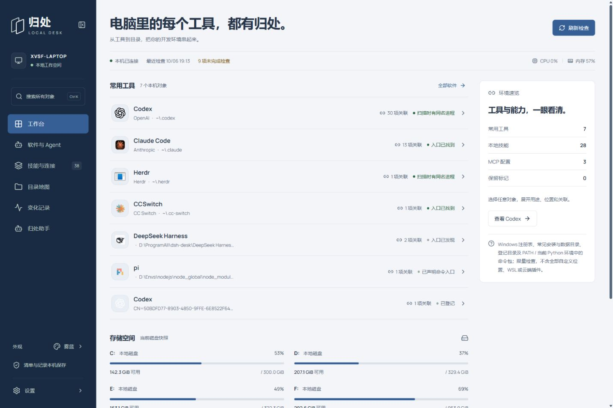
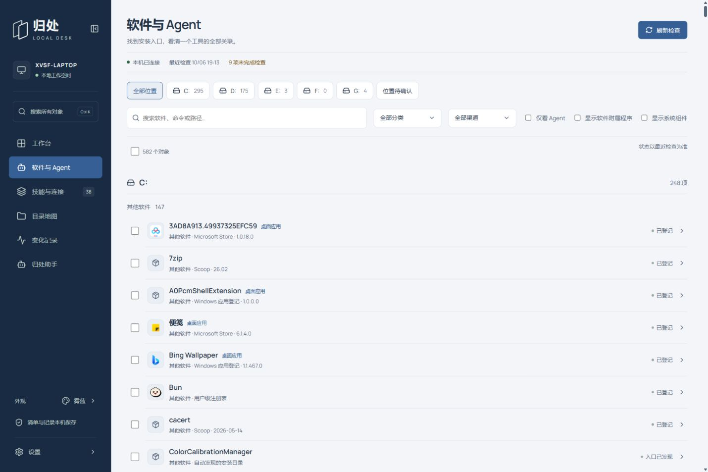
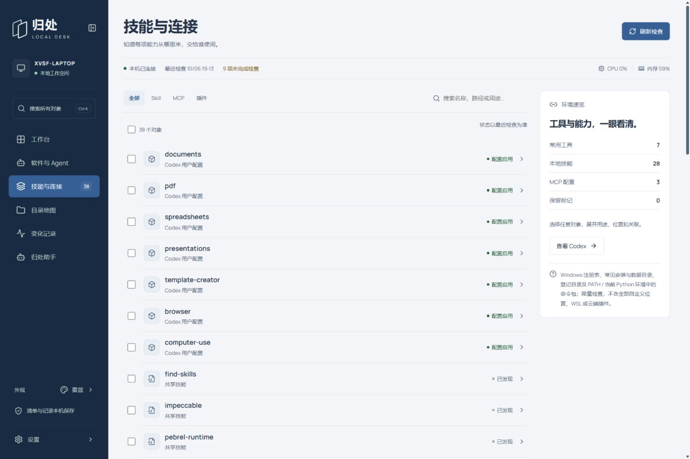
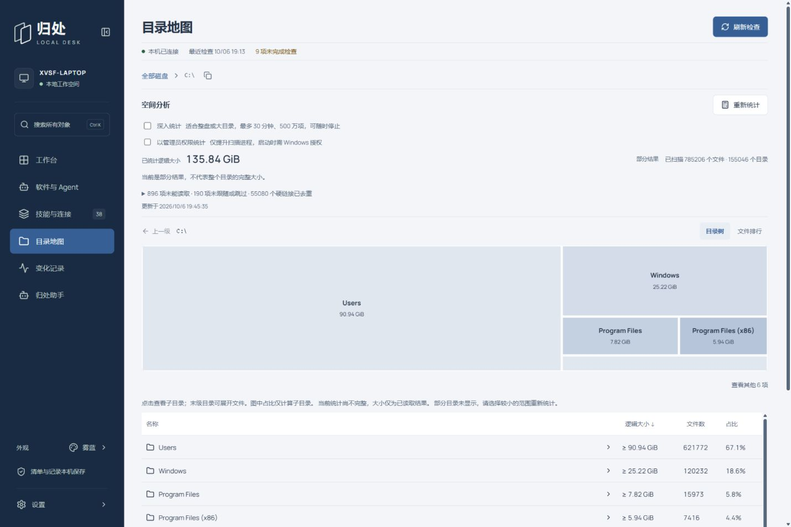
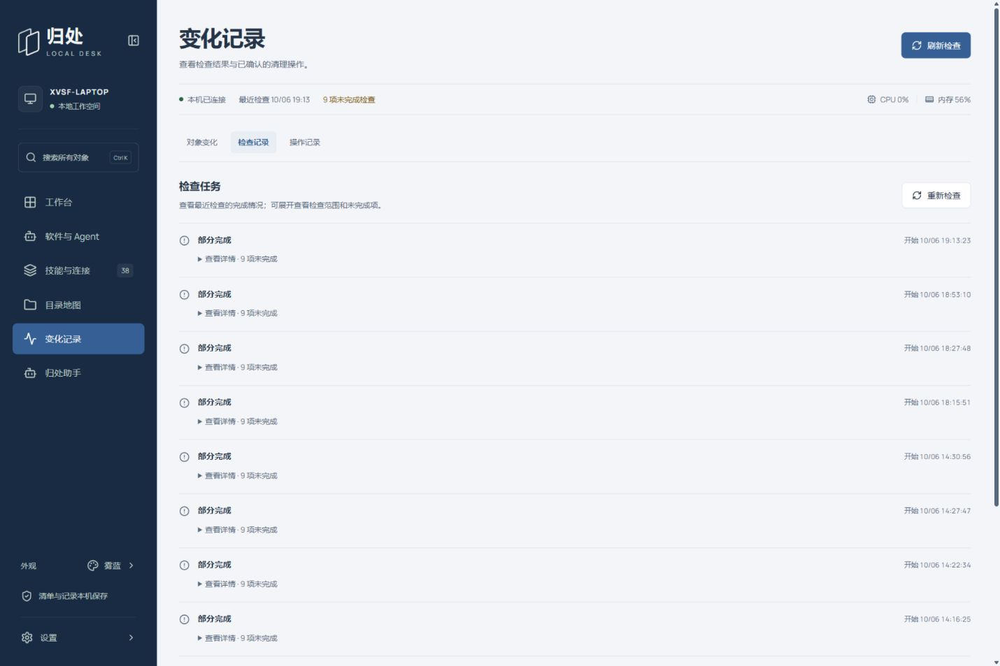

# 归处 · Guichu

**电脑里的每个工具，都有归处。**

归处是面向 Windows 的本机环境工作台：找到安装的软件和 AI Agent，看清它们的安装位置、配置、技能与 MCP；再通过目录地图和助手，决定如何整理。

[下载 Windows x64 便携版](https://github.com/XVSHIFU/guichu/releases/latest) · [更新日志](CHANGELOG.md) · [使用说明](app/README.md)

> 本页展示当前源码版本。已发布便携包的功能以对应 Release 说明为准，本次源码更新不代表便携包同步发布。



## 从找到，到看懂，再到整理

- **软件与 Agent**：按磁盘、分类、安装渠道查找工具，分别查看安装目录、程序入口和配置目录。CLI、桌面版和不同安装实例分别保留。
- **技能与连接**：集中查看 Skill、插件和 MCP，了解来源与关联工具；勾选多个对象，一起交给助手分析。
- **目录地图**：用矩形图定位空间占用，点击文件夹逐层放大；末级目录展开文件，文件排行帮助定位大文件。
- **归处助手**：连接自己的 OpenAI 兼容模型，查询本机证据、解释工具用途、生成受支持操作的修改预览。过程可折叠，指令可自定义。
- **变化记录**：对象变化、检查记录、操作记录分开查看；检查详情按需展开。
- **自己的外观**：28 套配色，支持浅色、深色与跟随系统，通过主题转盘或色样切换。

## 快速开始

### 使用便携版

1. 在 [Releases](https://github.com/XVSHIFU/guichu/releases/latest) 下载 Windows x64 便携包，完整解压。
2. 双击 **启动工作台.cmd**，浏览器打开 [本机工作台](http://127.0.0.1:8765/)。
3. 检查本机清单；如需助手，在 **设置 → 模型连接** 中填写服务地址、模型与密钥。

便携版无需另装 Python 或 Node.js。关闭网页不会停止服务，退出时运行 **停止工作台.cmd**。

### 从源码启动

需要 Windows、Python 3.12+、Node.js 20+。

```powershell
git clone https://github.com/XVSHIFU/guichu.git
cd guichu
python -m pip install -r app/requirements.txt
npm ci --prefix app
npm --prefix app run build
.\启动工作台.cmd
```

## 功能展示

以下是当前版本的实机截图。清单、统计结果和可用操作随本机环境而不同。

### 软件的位置与来源

按安装磁盘筛选，也可以结合分类、安装渠道和 Agent 标记查找。系统组件与软件附属程序默认隐藏，需要时可显示。安装渠道和下载来源分开记录，没有证据时保留未知，也允许手动补充。



扫描覆盖 Windows 软件登记、应用包、常见目录、登记目录，以及可发现的 npm、pnpm、pip、Conda、Scoop、Chocolatey、pipx、uv 等安装记录；不同渠道的识别覆盖并不相同。任意自定义位置、全部虚拟环境与下载历史不保证自动发现。

### 多个能力，一起交给助手

在软件页或技能与连接页勾选对象，查看选择摘要，再交给助手。一次最多附带 20 项；带入上下文后可以编辑问题，不会自动发送或执行修改。



配置存在、配置启用和连接可用是不同状态。归处保留检查依据，不把发现配置当成连接测试通过。

### 看清空间分布

目录树支持逐层下钻、返回上级和小项分组；缺失子目录统计时在原位置补充。文件排行展示本次统计中最大的 200 个文件，不是删除建议。



普通统计按需运行；整盘或大目录可选择 **深入统计**，最多 30 分钟、500 万项，可随时停止。未统计、权限不足和部分结果会明确显示。链接不重复遍历，硬链接只计一次；显示的是逻辑大小，与磁盘实际占用可能不同。

Windows 可选择 **以管理员权限统计**：仅提升扫描进程，由系统弹窗授权。管理员权限仍不保证能读取全部受保护文件。

### 记录有迹可查

将对象变化、检查任务和已执行操作分开查看，避免长日志挤在同一页。对象变化支持搜索，检查详情折叠，历史记录按需加载。



### 让助手帮助判断

例如，选中几个不熟悉的软件后询问：

> 逐项解释这些工具的用途、安装和配置位置，检查是否存在重复记录，先给出整理建议。

或者：

> 检查这个 MCP 的配置，说明当前证据能确定什么；需要修改时先展示预览。

受支持的修改由用户确认后执行，结果与备份信息保存在记录中。助手的自定义指令可以编辑；其判断仍需要结合实际证据，不能替代工具尚未提供的能力。

## 数据与备份

清单、备注与会话保存在本机。使用助手时，请求及相关上下文会发送到你配置的模型服务。

- **备份工作台.cmd**：备份工作台数据库。
- **导出工作台.cmd / 恢复工作台.cmd**：迁移工作台数据，操作前停止服务；恢复后重新配置模型密钥。
- 软件隐藏、分类和筛选不会删除实际文件；具体操作能力见 [应用说明](app/README.md)。

构建与迁移步骤见 [便携版说明](docs/PORTABLE.md)。

## 开发

React 界面位于 `app/src/`，Python 本机服务与扫描器位于 `app/`，Agent 指令与技能位于 `app/agent/`。运行数据、凭据、备份和测试产物不进入仓库；README 展示截图保存在 `docs/images/`。

```powershell
python -m unittest discover -s app/tests -p "test_*.py"
python scripts/verify_agent.py
npm --prefix app run build
# 启动工作台后运行隔离的核心界面回归
npm --prefix app run test:ui:core
```

[用户要求与完善清单](docs/USER-REQUIREMENTS.md) · [实施计划](docs/PLAN.md) · [Agent 验收记录](docs/AGENT-PLAN.md) · [社区主题来源](docs/COMMUNITY-THEMES.md)

## 社区与许可

[LINUX DO](https://linux.do/) · 开发者交流社区。

MIT。第三方依赖、图标、字体与社区主题遵循各自许可证。
